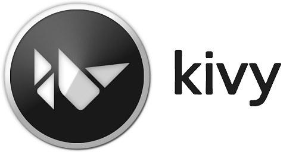

# Django REST Framework avec Kivy et kivy

                              

## Qu'est-ce que Django ?

Django est un framework Web gratuit, open source, basé sur Python qui suit le modèle architectural Model-View-Template (MVT). Cela réduit les tracas du développement Web afin que vous puissiez vous concentrer sur l'écriture de votre application au lieu de réinventer la roue.

## Qu'est-ce qu'une API REST ?
Une API REST est un moyen populaire pour les systèmes d'exposer des fonctions et des données utiles. REST, qui signifie transfert d'état représentatif, peut être composé d'une ou plusieurs ressources accessibles à une URL donnée et renvoyées dans divers formats, tels que JSON, images, HTML, etc.

## Pourquoi le framework Django REST ?

Django REST Framework est une boite à outils puissante et flexible qui vous facilite la création d'application web API . Son principal avantage est qu'il rend la sérialisation beaucoup plus facile .

Le framework Django REST est basé sur les vues basées sur les classes de Django, c'est donc une excellente option si vous êtes familier avec Django. Il adopte des implémentations telles que des vues basées sur des classes, des formulaires, un validateur de modèle, QuerySet, etc.

## Mise en place du framework Django REST

Idéalement, vous voudriez créer un environnement virtuel pour isoler les dépendances, cependant, cela est facultatif. Exécutez la commande à partir de votre dossier de projets pour créer l'environnement virtuel. Ensuite, courez pour l'allumer. ```python -m venv django_envsource ./django_env/bin/activate```

N'oubliez pas que vous devrez réactiver votre environnement virtuel à chaque nouvelle session de terminal. Vous saurez qu'il est activé car le nom de l'environnement fera partie de l'invite du shell.

Install:

```pip installer Django```
```pip installer django_rest_framework```

## Structure RESTful : méthodes GET, POST, PUTet DELETE

Dans une API RESTful, les points de terminaison définissent la structure et l'utilisation avec les méthodes GET, POST, PUTet DELETEHTTP. Vous devez organiser ces méthodes logiquement.

Pour montrer comment créer une application RESTful avec le framework Django REST, nous allons créer un exemple d'API de Chat Message. Nous utiliserons deux points de terminaison avec leurs méthodes HTTP respectives, comme indiqué dans le tableau ci-dessous :

| Point final | []() |[]() | []() | []() |
| ----------- | ----|------|-----|--------|
| http://127.0.0.1:8000/api/ |1. Lister tout : répertorier toutes les Chats pour l'utilisateur demandé |2. Créer : ajouter une nouvelle Chat |Pas / Ajout|Pas / Ajout|
| http://127.0.0.1:8000/api//api/chat/<int:chat_id> | 3. Récupérer : obtenir un message chat à faire avec une donnée chat_id |Pas / Ajout|4. Mettre à jour : mettre à jour une tâche avec une donnée chat_id|5. Supprimer : Supprimer une tâche avec une donnée chat_id|
